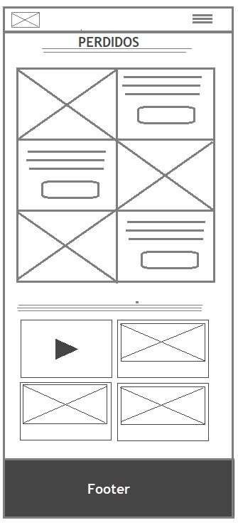
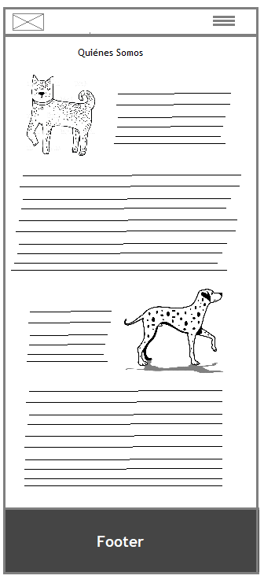

# PROYECTO FINAL
##  Tema
El tema seleccionado es mascotas perdidas en la comuna de Quilicura, como así también otras materias relativas a mascotas y animales.
## Objetivos
### UI
La página será responsiva.

Al visualizarla en dispositivos móviles, se podrá apreciar inmediatamente la información relevante a mascotas perdidas.

El sitio utilizará los siguientes colores:

Las tipografías utilizadas serán Raleway para el texto y Ubuntu para los títulos.

El tamaño de la fuente será 12.

El usuario a través del navbar podrá acceder a las distintas páginas, en las cuales se podrá visualizar esta barra de navegación fija.

En todas las páginas el usuario podrá acceder a la información de las redes sociales, lo cual estará posicionado bajo criterios de accesibilidad.

En todas las páginas el usuario podrá visualizar los datos de contacto con la unidad de salud municipal.

### UX
Con la finalidad de que el sitio se convierta en una herramienta real para la centralización de información de mascotas perdidas, la experiencia del usuario debe ser lo más práctica, fácil y cómoda posible, es decir, que el registrar la perdida de una mascota, como a su vez, aportar en la búsqueda de éstas, no requiera de pasos innecesarios y excesivos. Además, que ésta página se pueda asociar con las redes sociales, que permitan publicar la información de forma simple y rápida.

A través de este sitio, se espera que las personas sientan que es una página fácil y práctica de usar, que sea bonita y atractiva para que el usuario precise ingresar nuevamente.

## Requerimientos del sitio 
El usuario a través del navbar responsivo podrá acceder a las páginas de Inicio, Quiénes Somos, Perdidos, Noticias y Datos y Tips. En todas las páginas se podrá visualizar esta barra de navegación fija.

#### En la página inicio:
•    El inicio dispondrá de un banner carrousel de noticias destacadas y propaganda (esterilización, apoyo a la adopción animal, etc.), las cuales se podrán visualizar de forma independiente en otras páginas correspondientes.

•    Se visualizarán las últimas publicaciones de mascotas perdidas ingresadas en formato blog.

•    Se visualizará un video con información o noticias relativas a las mascotas (En dispositivos móviles no se visualizará).

•    La información dispuesta en el Dropdwn del navbar se visualizará al costado (ancla).

#### En Quiénes Somos 
• Se visualizará un texto informativo de los objetivos del sitio.
#### En Perdidos
• Se visualizará la información de las mascotas perdidas (histórica) y el estado de su búsqueda.
• Se dispondrá un formulario de contacto para ingresar la información de mascotas perdidas.
#### En Noticias
• Se publicarán noticias de distinta índole relativas a mascotas.
en Línea debe contener un botón con acceso a los resultados de exámenes de laboratorio en línea.

#### En Datos y más
•  Se publicará información de negocios logales relativos a las mascotas (tiendas, veterinarias), de las cuales podamos obtener recomendaciones y valoraciones.

• Se publicará información relativa a organizaciones, propuestas e iniciativa de ayuda animal.

• Se publicará información relativa al ocio doméstico para las mascotas (alimentación, juguetes, actividades).

## Layout
El sitio será de tipo Blog, con dos columnas: una grande (8 columnas de la grilla) con la información relevante y una pequeña (4 columnas de la grilla) con información anexa.
Para dispositivos móviles, se dispondrá de sólo una columna.

## Boceto 

### Index

##### Index Responsivo

### Quiés Somos

##### Quiénes Somos Responsivo

### Perdidos

##### Perdidos Responsivo

### Noticias

##### Noticias Responsivo

### Datos y más

##### Datos y más Responsivo

